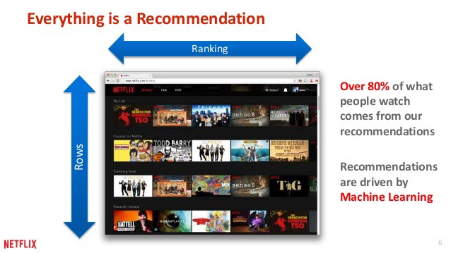

## Project Overview
Content-based and Collaborative Recommender systems are built on MovieLens dataset with 100,000 movie ratings. These Recommender systems were built using Pandas operations and by fitting KNN, SVD & deep learning models which use NLP techniques and NN architecture to suggest movies for the users based on similar users and for queries specific to genre, user, movie, rating, popularity.

## Contents

- [Recommender System Overview](#recommender-system-overview)
   - [Content-based Filtering](#content-based-recommender-system)
   - [Collaborative Filtering](#collaborative-recommender-system)
   - [Knowledge based Recommender System](#knowledge-based-recommender-systems)
   - [Hybrid Recommender](#hybrid-recommender-system)
   - [Common Challenges](#common-challenges)
   
 - [About DataSet](#about-dataset-used)
 
 - [Data Visualizations and Manipulations](#Data-Visualizations-and-Manipulations)
 	- Dataframes formed and used
 	- [Reshaping the dataframe](#reshaping-the-dataframe-to-make-it-compatible-for-knn-algorithm-implementation)

- Movie Recommender System Development
	- [Knowledge based Recommender System](#knowledge-based-recommender-system)
	- [Movie Recommendation Engine Development with KNN](#item-based-collaborative-recommender-system-using-knn)
  		- [Movie Recommender System for a User](#movie-recommender-system-for-a-user)
  		- [Movie Recommender System using Movie Name](#movie-recommender-system-using-movie-name) 
        		- Along with [Dynamic movie name Suggestor](#dynamic-movie-name-suggestor)
	- [Recommender System using Singular Value Decomposition(SVD)](#recommender-system-using-svd)
	- [Recommender System using Deep Neural Network (DNN) models](#recommender-system-using-softmax-deep-neural-networks)
  

## Recommender System Overview
A recommender system is a subclass of information filtering system that seeks to predict the "rating" or "preference" a user would give to an item. Recommender systems are utilized in a variety of areas including movies, music, news, social tags, and products in general. Recommender systems typically produce a list of recommendations and there are few ways in which it can be done. Two of the most popular ways are – through collaborative filtering or through content-based filtering.

Most internet products we use today are powered by recommender systems. YouTube, Netflix, Amazon, Pinterest, and long list of other internet products all rely on recommender systems to filter millions of contents and make personalized recommendations to their users. Recommender systems are well-studied and proven to provide tremendous values to internet businesses and their consumers.

There are majorly six types of recommender systems which work primarily in the Media and Entertainment industry: 
- Collaborative Recommender system
- Content-based recommender system
- Knowledge based recommender system
- Hybrid recommender system
- Demographic based recommender system
- Utility based recommender system

Recommender System is a vast concept rooted from a base idea of giving out suggestions to the users. There are wide range of algorithms are used to build a recommender system and the type of recommender system used is mostly dictated by the type of data available. In this project, first three of the above recommender systems were built.

#### Content based recommender system
This approach utilizes a series of discrete characteristics of an item in order to recommend additional items with similar properties. Content-based filtering methods are based on a description of the item and a profile of the user's preferences. To keep it simple, it will suggest you similar movies based on the movie we give (movie name would be the input) or based on all of the movies watched by a user (user is the input). It extracts features of a item and it can also look at the user's history to make the suggestions.

#### Collaborative recommender system
Collaborative filtering is based on the assumption that people who agreed in the past will agree in the future, and that they will like similar kinds of items as they liked in the past. The system generates recommendations using only information about rating profiles for different users or items. By locating peer users/items with a rating history similar to the current user or item, they generate recommendations using this neighborhood. This approach builds a model from a user’s past behaviors (items previously purchased or selected and/or numerical ratings given to those items) as well as similar decisions made by other users. This model is then used to predict items (or ratings for items) that the user may have an interest in. Collaborative filtering methods are classified as memory-based and model-based.

#### Knowledge based recommender systems
These are based on explicit knowledge about the item assortment, user preferences, and recommendation criteria (i.e., which item should be recommended in which context). These systems are applied in scenarios where alternative approaches such as collaborative filtering and content-based filtering cannot be applied. In simple terms, knowledge based recommender system can be used to suggest content/item to a new user or an anonymous user who doesn't have any history.

#### Hybrid recommender system
This combines more than one of these techniques to resolve one or more problems. This approach can be used to overcome some of the common problems in recommender systems such as cold start and the sparsity problem in collaborative approach, as well as the knowledge engineering bottleneck in knowledge-based approaches. It is proved that hybrid recommender system performs extremely well compared to pure collaborative and content based methods.

#### Common Challenges
In this project, three of the above recommender systems were build using different algorithms. Following challenges were encountered while building these recommender systems:
* cold start
* data sparsity
* popular bias (how to recommend products from the tail of product distribution)
* User Inconvinience with spelling while giving movie names as input (can't expect to give exact movie name everytime)
* scalability (computation grows as number of users and items grow)
* pool relationship between like-minded yet sparse users

Above chart is the distribution of item rating frequency. This distribution often satisfies a property in real-world settings, which is referred to as [the long-tail property [1]](https://www.springer.com/cda/content/document/cda_downloaddocument/9783319296579-c1.pdf?SGWID=0-0-45-1554478-p179516130). According to this property, only a small fraction of the items are rated frequently. Such items are referred to as popular items. The vast majority of items are rated rarely. 

In most cases, high-frequency items tend to be relatively competitive items with little profit for the merchant. On the other hand, the lower frequency items have larger profit margins. However, many recommendation algorithms have a tendency to suggest popular items rather than infrequent items. This phenomenon also has a negative impact on diversity, and users may often become bored by receiving the same set of recommendations of popular items

**A solution for long-tail could be**
Use matrix factorization technique to train model to learn user-item interaction by capturing user information in user latent factors and item information in item latent factors. Meanwhile, matrix factorization technique can significantly reduce dimensionality and sparsity and it will reduce huge amount of memory footprint and make our system more scalable

